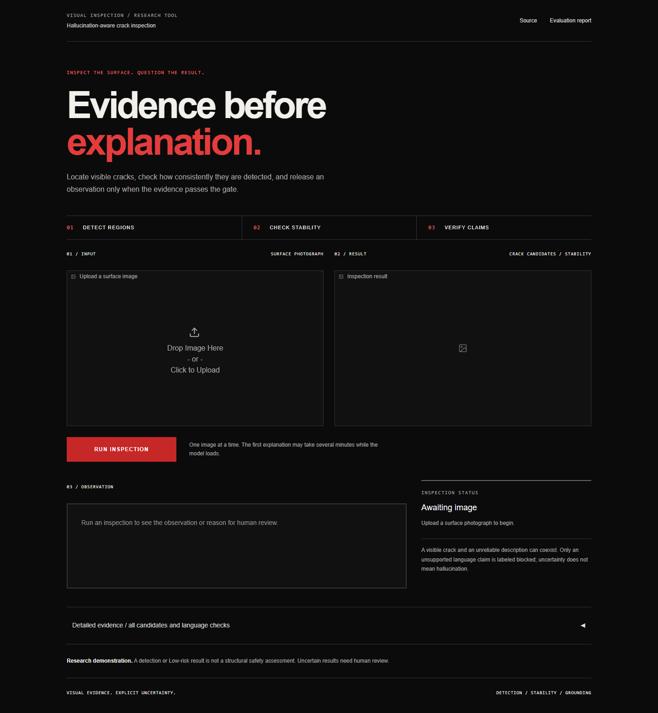
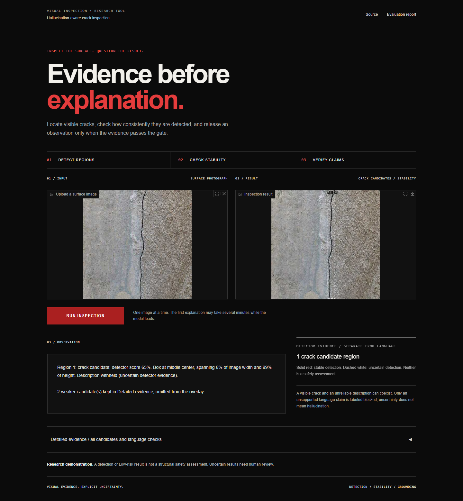

# Hallucination-Aware Visual Inspection Assistant

**[Open the live demo](https://985c93b43c166c52dc.gradio.live)** | [Hosting instructions](DEPLOYMENT.md)

Temporary public demo launched September 21, 2026. The link expires after one week and works only while the host computer and app are running. Permanent cloud hosting is not yet configured.



A CPU-capable crack-inspection demonstration that places a deterministic uncertainty gate between a YOLOv8 segmentation detector and Moondream2. The language model can describe a detected region only when the detector's original pass exists and five-pass confidence stability is classified Low risk. Otherwise the system returns a no-detection or human-review message without calling the VLM.

This is a research demonstration, not a structural assessment, safety certification, or replacement for a qualified inspector.

## Reading the inspection result

The page separates **crack candidates** from **language reliability**. Solid red boxes mark candidates that pass the existing TTA language gate; dashed white boxes mark uncertain candidates. A withheld description does not mean the crack is a hallucination. Only explicit grounding/unsupported-claim failures are labeled as blocked language claims.

The overlay uses a separately calibrated localization threshold (0.305). Weaker candidates still receive all five TTA passes and remain in Detailed evidence. Image-level crack presence retains the sensitive 0.01 floor: a trial increase did not improve external accuracy consistently. Detector scores are not probabilities that a crack is real. See the full before/after results and recall tradeoffs in [REPORT.md](REPORT.md).



Example: Crack-Seg evaluation sample 112, recorded in `evidence/v2/split_manifest.json`. This screenshot illustrates behavior; it is not a separate accuracy benchmark.

## Architecture

```text
image
  → YOLOv8s segmentation × 5 deterministic passes
  → mean confidence + population confidence standard deviation
  → Low / Medium / High gate
       Low             → expanded detector crop → Moondream2 → language guard
       Medium or High  → explanation withheld; VLM skipped
       no base box     → "No defect detected."; VLM skipped
```

`inspect(image)` in `pipeline.py` is the sole public inspection entrypoint and the only route allowed to invoke the VLM.

## Models and Fixed Configuration

- Detector: `OpenSistemas/YOLOv8-crack-seg`, `yolov8s/weights/best.pt`, revision `910c33b45c040fd8b1cb93eae3fb08ec2ca8b956`, SHA-256 `aceae4a99a4e7903a78d11336afc71b4cb47318888d87279922687bfeb16637d`, AGPL-3.0.
- VLM: `vikhyatk/moondream2`, revision `2024-08-26` (resolved commit `92d3d73b6fd61ab84d9fe093a9c7fd8c04bf2c0d`), Apache-2.0.
- Confidence threshold: `0.35`.
- TTA standard-deviation threshold: loaded from `models/gate_calibration.json` by default CLI/UI inspection; `PipelineConfig()` retains explicit legacy defaults for historical experiments.
- Detector inference floor: `0.01`.
- Crop expansion: 15% on each side, clamped to image bounds.
- Device: automatic CUDA when available; CPU fp32 otherwise.

The result key `variance` is retained for compatibility but contains population standard deviation of the five TTA confidences. It is an empirical stability measure, not mathematical variance and not Bayesian uncertainty.

## Setup

Python 3.11 is the verified environment.

```powershell
python -m venv .venv
.\.venv\Scripts\Activate.ps1
python -m pip install -r requirements.txt
python diagnostics.py
```

The detector checkpoint must exist at `models/crack_yolov8s_best.pt` and match `models/MODEL_SOURCE.json`. Moondream weights are loaded lazily from the Hugging Face cache. The model uses pinned remote code, so review the pinned revision and source metadata before deploying in a trusted environment.

## Run

CLI:

```powershell
python pipeline.py test_images\clear_01.jpg
python pipeline.py test_images\clear_01.jpg --save-annotated output.jpg --save-json output.json
```

Gradio:

```powershell
python app.py
```

Then open `http://127.0.0.1:7860`. Use `--host`, `--port`, or `--share` only when the corresponding network exposure is intentional.

The UI numbers every original-pass box and shows per-region risk, TTA statistics, and explanation or refusal. Each region is matched across inverse-transformed TTA boxes and gated independently; the image risk is the highest region risk. The language guard checks measured crop geometry as well as diagnostic keywords. Requests are queued with concurrency one to limit CPU/RAM contention.

## V2 Evaluation

`evaluate_v2.py` provides seeded data selection, hashed inference caches, disjoint threshold calibration, confidence intervals, external SDNET2018 execution, per-region coverage, a 30-output grounding challenge, and a 3/5/8/10/15-pass TTA audit. Run its `download`, `prepare`, `detect`, `summarize`, `external-vlm`, and `report` phases in order. See [REPORT.md](REPORT.md) for measured results and [evidence/v2/results.json](evidence/v2/results.json) for machine-readable KPIs.

The larger Crack-Seg sample is not a fresh 200-image held-out test set: the source has only 112 official test images, and its sole negative is in validation and was already used in the pilot. The reports disclose this limitation and keep evaluation images disjoint from the new calibration subset. No statistical guarantee of language truth is asserted.

## Pilot Evaluation (superseded)

The locked five-image acceptance evidence demonstrates all required directions:

- Three clear cases classified Low and invoked the real VLM.
- The real ambiguous shadow case classified High and did not invoke the VLM.
- The synthetic background produced no base detection and did not invoke the VLM.
- A spy at the VLM loader boundary confirmed zero calls for the withheld case.
- Repeated clear and ambiguous runs produced identical five-value TTA vectors and gate labels.

The approved expanded evidence has 29 rows: 5 original plus 24 additional images selected deterministically from the already-integrated Crack-Seg test/validation splits. It produced 13 Low/VLM-called, 15 Medium-or-High/withheld, and 1 no-detection result. The sole empty-label dataset frame was a Low-risk false positive and invoked the VLM.

For the manually labeled original five, detector presence achieved 75% precision, 100% recall, and 80% accuracy. This is `n=5`, illustrative only, not a statistically powered evaluation.

CPU-only latency over 29 images:

- Median base inference: 0.389 s.
- Median five-pass TTA: 1.878 s.
- VLM cold start including load: 49.149 s.
- Warm VLM inference: 24.040 s mean, 22.492 s median, 31.697 s P95 (`n=12`).

See `TEST_RESULTS.md`, `SENSITIVITY.md`, and `REPORT.md` for complete evidence and interpretation.

## Tests

```powershell
python -m pytest -q
python -m ruff check app.py pipeline.py diagnostics.py evaluate.py instrumentation tests
python -m pip check
```

Tests cover TTA order and statistics, missing detections, boundary risks, box expansion, invalid inputs, VLM invocation/non-invocation, language normalization/guarding, UI formatting, and model-free UI construction.

## Important Limitations

- The legacy threshold `0.03` came from selected pilot cases. The v2 threshold is fitted to a separate calibration subset, but model-selection exposure and sparse negatives limit generalization claims.
- The 29-image expansion is curated from one dataset and is not independent external validation. The requested `0.13–0.17` sensitivity grid was internally stable, but 15/29 labels differ between shipped `0.03` and reference `0.15`.
- The detector confuses some shadows, edges, wires, and background patterns with cracks. The empty-label false positive proves TTA stability does not imply semantic correctness.
- The gate regulates explanation release; it does not establish detector correctness or crack severity.
- Moondream output can contain unsupported claims. A language guard fails closed on known patterns, but no finite word list guarantees complete semantic safety.
- CPU fp32 inference is slow and memory intensive. Latency depends on hardware, cache state, image, and system load.
- All base detections are now processed; box association can still fail under strong transforms, and bbox geometry cannot verify arbitrary appearance or severity claims.
- The `.pt` detector checkpoint uses pickle-based loading and carries AGPL-3.0 obligations. Moondream requires pinned `trust_remote_code`; both are supply-chain considerations.

## Project Files

- `pipeline.py` — detector, TTA, risk gate, VLM boundary, CLI.
- `app.py` — minimal Gradio UI.
- `diagnostics.py` — environment and checkpoint preflight.
- `evaluate.py` — locked five-image evidence runner.
- `evaluate_v2.py` — reproducible v2 dataset, calibration, external, grounding and TTA evaluations.
- `instrumentation/` — approved expanded evidence, latency, sensitivity, and integrity tooling.
- `tests/` — automated tests.
- `TEST_RESULTS.md`, `SENSITIVITY.md`, `REPORT.md`, `DECISIONS.md` — evidence and documentation.
- `models/` — detector checkpoint and reproducible model metadata.
- `test_images/` — original fixtures and approved Crack-Seg expansion.
- `evidence/` — machine-readable results, logs, annotations, and hashes.

Final project status: **COMPLETE WITH DOCUMENTED LIMITATIONS**.
