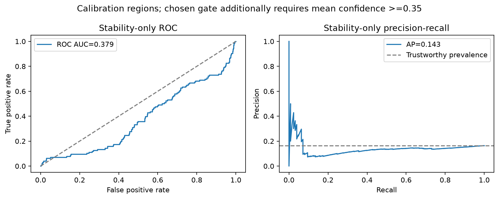
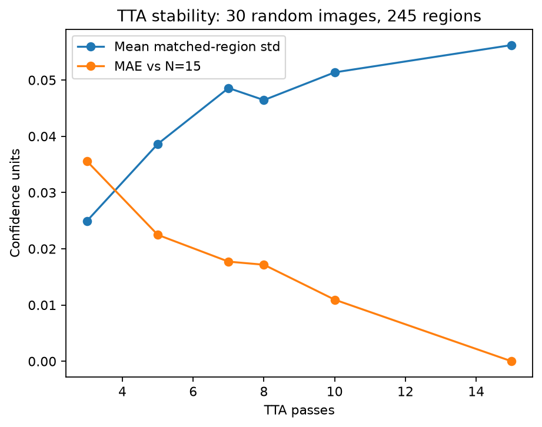

# Test Results

| Metric | Old (n=5/29) | New (n=200 + external n=200) | Delta |
|---|---|---|---|
| Precision | 75.00% (n=5) | Crack-Seg 99.50%; SDNET 69.63% | In-domain vs pilot +24.50 pp; domain gap -29.87 pp |
| Recall | 100.00% (n=5) | Crack-Seg 100.00%; SDNET 94.00% | In-domain vs pilot +0.00 pp; domain gap -6.00 pp |
| F1 | 85.71% (n=5) | Crack-Seg 99.75%; SDNET 80.00% | In-domain vs pilot +14.04 pp; domain gap -19.75 pp |
| Accuracy | 80.00% (n=5) | Crack-Seg 99.50%; SDNET 76.50% | In-domain vs pilot +19.50 pp; domain gap -23.00 pp |
| Regions handled/image | 1.000 (old algorithm replay, n=200) | 9.075 | +8.075 |
| Correctly localized regions/image | 0.880 (old algorithm replay, n=200) | 1.145 | +0.265 |
| Grounding hallucination recall | 20.00% (word-list replay, n=30) | 100.00% | +80.00 pp |
| TTA-std threshold | 0.030000 | 0.016384 | -0.013616 |
| Stability ROC-AUC / PR-AUC (AP) | Not measured | 0.3788 / 0.1430 | Newly measured |

## V2 Evaluation — measured results and limits

**Task 1 is not fully satisfiable with this checkpoint and dataset.** The source has 3,717 training, 200 validation and 112 test images. Only one image has an empty label, in validation, and that image was already used in the n=29 pilot. Validation also participated in checkpoint selection. The new 200-image benchmark is a seeded, stratified sample of non-training partitions (199 positive, 1 negative), **not 200 newly untouched held-out images**. No training images or invented negatives were added to meet the count. The pilot is superseded for descriptive benchmark reporting, but its historical records remain below.

The remaining 111 unique non-training images calibrate the gate and are disjoint from the 200 scoring images. One exact duplicate was excluded before sampling. Selection uses labels, seed 20260907 and no detector scores. Bootstrap CIs condition on the observed class proportions; the lone in-domain negative cannot establish useful real-world false-positive performance, regardless of narrow aggregate intervals. A genuinely fresh balanced test set requires additional annotations/data or retraining a checkpoint on a newly partitioned corpus.

External validation uses 200 randomly sampled SDNET2018 patches (100 cracked, 100 non-cracked). [The original authors](https://digitalcommons.usu.edu/all_datasets/48/) publish SDNET2018 under CC BY 4.0: Maguire, Dorafshan & Thomas (2018), Utah State University, DOI 10.15142/T3TD19. The official binary endpoint returned HTTP 403; the public Kaggle mirror is recorded in the manifest, while the original license takes precedence over the mirror's CC0 tag. This is a separate source dataset, and selected exact-byte training overlaps are excluded. The checkpoint's full source-image lineage is unavailable: **never-seen status cannot be guaranteed against resized/cropped derivatives or pretraining exposure**. SDNET patches can share parent photographs, so image-level intervals can understate scene-level uncertainty.

### Detection metrics

Positive prediction means at least one original-pass box at the unchanged 0.01 inference floor, matching the pilot's `detected` definition. These are image-level crack-presence metrics, not segmentation IoU or language factuality. JSON includes 5,000 stratified image bootstrap resamples; these degenerate to zero width for an all-positive predictor. The primary intervals below instead propagate simultaneous 97.5% exact binomial intervals for sensitivity and specificity through each metric at the fixed sampled class prevalence (Bonferroni gives at least 95% joint coverage under independent images). This also provides a nondegenerate F1 interval. Class prevalence differs sharply between datasets; the domain gap includes this prevalence effect.

| Dataset | Metric | Estimate | Conservative 95% CI | Full CI width |
|---|---|---:|---|---:|
| evaluation | precision | 99.50% | [99.49%, 99.99%] | 0.50% |
| evaluation | recall | 100.00% | [97.82%, 100.00%] | 2.18% |
| evaluation | f1 | 99.75% | [98.65%, 100.00%] | 1.35% |
| evaluation | accuracy | 99.50% | [97.33%, 99.99%] | 2.66% |
| external | precision | 69.63% | [62.11%, 76.58%] | 14.47% |
| external | recall | 94.00% | [86.36%, 98.09%] | 11.73% |
| external | f1 | 80.00% | [72.26%, 86.01%] | 13.76% |
| external | accuracy | 76.50% | [66.84%, 84.05%] | 17.21% |

evaluation: TP=199, FP=1, TN=0, FN=0. At confidence >=0.35, precision/recall/F1 = 99.49%/97.49%/98.48%.

Exact binomial 95% intervals (image-level independence assumed): precision [97.25%, 99.99%]; recall [98.16%, 100.00%]; specificity [0.00%, 97.50%]; accuracy [97.25%, 99.99%].

external: TP=94, FP=41, TN=59, FN=6. At confidence >=0.35, precision/recall/F1 = 87.72%/50.00%/63.69%.

Exact binomial 95% intervals (image-level independence assumed): precision [61.13%, 77.24%]; recall [87.40%, 97.77%]; specificity [48.71%, 68.74%]; accuracy [70.00%, 82.19%].

### Calibration and false-explanation proxy

Trust means a unique detection matches a ground-truth polygon's enclosing box at IoU >=0.5, with greedy one-to-one matching. It is an operational localization proxy, not a human label of language truth and not the old risk label. Calibration contains 771 detections, 126 trustworthy. Stability alone uses score `-TTA_std`; ROC-AUC=0.3788, PR-AUC (average precision)=0.1430. AUC-PR is reported as average precision rather than trapezoidal area.

Selection maximizes recall of trustworthy regions subject to <=5% empirical false detections among Low gates; lower false fraction and then smaller threshold break ties. The confidence floor for Low remains 0.35. ROC/PR arrays and every candidate operating point are in `evidence/v2/calibration_curve.json`. Chosen std threshold: **0.016384**. The deployable artifact is `models/gate_calibration.json`; default CLI/UI inspection checks its detector hash before use. Medium/High retain the existing 1.5x std boundary, which is a policy convention, not a calibrated probability.

| Sample / operating point | Low regions | False Low | False-explanation proxy | True-Low recall | One-sided 95% binomial upper bound |
|---|---:|---:|---:|---:|---:|
| legacy_top_calibration | 75 | 6 | 8.00% | 69.70% | 15.18% |
| old | 68 | 7 | 10.29% | 48.41% | 18.47% |
| chosen | 42 | 2 | 4.76% | 31.75% | 14.24% |
| legacy_top_evaluation | 133 | 10 | 7.52% | 69.89% | 12.42% |
| evaluation_old | 108 | 8 | 7.41% | 43.67% | 12.97% |
| evaluation_chosen | 60 | 3 | 5.00% | 24.89% | 12.42% |

`legacy_top_*` replays the original highest-confidence-per-pass algorithm at 0.03. `old`/`evaluation_old` apply 0.03 to the new matched per-region sequences, isolating the threshold change. The denominators differ between top-only and all-region policies.

| AUC population | Regions | Trustworthy prevalence | ROC-AUC | PR-AUC (AP) |
|---|---:|---:|---:|---:|
| calibration_all_auc | 771 | 16.34% | 0.3788 | 0.1430 |
| calibration_confidence_eligible_auc | 137 | 76.64% | 0.7113 | 0.8935 |
| evaluation_all_auc | 1815 | 12.62% | 0.3458 | 0.0950 |
| evaluation_confidence_eligible_auc | 255 | 72.55% | 0.7098 | 0.8788 |



Stability alone ranks trust worse than chance across all floor-level proposals. Very low-confidence false proposals can also have very low variance. The confidence-conditioned AUC is stronger, supporting the combined confidence-and-stability gate rather than treating TTA std as a calibrated trust probability.

**No <=5% at 95% confidence guarantee is claimed.** Selection-set binomial bounds are descriptive after threshold search, boxes cluster within images, and the evaluation includes model-selection exposure. Even an independent zero-error sample needs at least 59 accepted independent cases for a one-sided exact 95% upper bound <=5%. The stretch KPI is not achieved. Calibration is never fitted on SDNET2018.

### Per-detection coverage

Five image-level passes are shared for efficiency. Every base box at the 0.01 floor gets its own matched confidence sequence, risk, crop and language decision. Boxes are inverse-transformed before greedy highest-IoU matching (minimum IoU 0.3), each augmented box is used at most once, and missing matches contribute zero. Secondary regions appear in JSON, numbered annotations and the UI. Image risk is the highest region risk; scalar confidence/box fields retain top-region compatibility.

| Set | Old handled/image | New handled/image | Multi-detection images |
|---|---:|---:|---:|
| evaluation | 1.000 | 9.075 | 183/200 |
| external | 0.675 | 3.160 | 102/200 |

Correctly localized regions on the 200-image benchmark increase from 176 (0.880/image) to 229 (1.145/image), against 251 labeled regions. Processing all predictions does not imply all are correct. SDNET has image labels, so external per-region correctness is unavailable.

### Grounding verifier

The verifier uses crop-relative bounding-box center, width, height, area, aspect ratio and TTA-mean confidence. Explicit location/orientation and percentage claims are checked before surfacing. The old diagnostic blocklist remains in force. Contradictions fail closed. Box orientation is only a geometric proxy; branching, appearance, severity, vague paraphrases and all general semantic hallucinations are not certified. The checker records which claims were checked, including an empty list when none were measurable.

The fixed 30-output challenge set contains 15 supported and 15 hallucinated outputs across three geometry templates. Old guard: precision 100.00%, recall 20.00%, F1 33.33%. New verifier: precision 100.00%, recall 100.00%, F1 100.00%. These are real executions on authored adversarial text, **not estimates of natural Moondream hallucination prevalence**; template correlation and narrow vocabulary limit generalization. All prompts, labels, measurements and verdicts are in `grounding_benchmark.json`.

### TTA diversity and pass count

The existing five passes were already diverse in kind: original, horizontal flip, brightness 0.8, contrast 1.15 and rotation +3 degrees. The new audit adds vertical flip, scale 0.85/1.15, color 0.5/1.5, brightness 1.2, contrast 0.85 and rotations -3/+7/-7. Deterministic transforms are reproducible perturbations, not independent posterior samples. Color/contrast can be weak on gray or uniform surfaces. Normalized pixel-change measurements for every transform are in `results.json`.

Thirty randomly sampled images (245 base detections) use a nested 15-pass sequence. Every N is compared on the same regions, with missing matches retained as zero. The reference is N=15, not the true uncertainty.

| N | Mean std | Mean absolute error vs N=15 | Relative MAE vs N=15 |
|---:|---:|---:|---:|
| 3 | 0.02496 | 0.03556 | 63.26% |
| 5 | 0.03864 | 0.02248 | 39.98% |
| 7 | 0.04858 | 0.01772 | 31.51% |
| 8 | 0.04644 | 0.01717 | 30.53% |
| 10 | 0.05137 | 0.01095 | 19.48% |
| 15 | 0.05622 | 0.00000 | 0.00% |

First tested N below 10% relative MAE (excluding the reference itself): **not reached before N=15**. Production retains N=5 because this is the evaluated/calibrated operating point; the curve does not by itself establish a better gate at larger N. This is a latency/calibration choice, not a claim that five passes have converged. **The convergence target is not achieved.** Increasing production N requires recalibrating and scoring the entire gate at that N; N=15 agreeing with itself is not evidence of convergence.



### Real external language-stage execution

All 200 external images passed through `inspect()` using replayed, hashed real detector results and the real pinned Moondream2 loader. There were 5 region-level VLM calls across 5 images, 3 surfaced explanations and 2 failed-closed outputs. Negative images incorrectly gated Low: 0. Language-stage wall time (including loading) was 405.6s; cached detector times are recorded separately. No stub VLM was used for this evaluation.

### Reproduction and artifacts

Use the pinned dependencies in `requirements.txt`. Dataset files are ignored by Git. Crack-Seg is the existing cached [official archive](https://github.com/ultralytics/assets/releases/download/v0.0.0/crack-seg.zip); extract it under `~/.cache/hallucination-aware-visual-inspection/` or override `--crack-root`. Selected image and label hashes are in the manifest. Override `--external-root` for other locations. SDNET's downloaded archive must match the pinned checksum before extraction.

```powershell
.venv/Scripts/python.exe evaluate_v2.py download
.venv/Scripts/python.exe evaluate_v2.py prepare
.venv/Scripts/python.exe evaluate_v2.py detect
.venv/Scripts/python.exe evaluate_v2.py summarize
.venv/Scripts/python.exe evaluate_v2.py external-vlm
.venv/Scripts/python.exe evaluate_v2.py deploy
.venv/Scripts/python.exe evaluate_v2.py report
.venv/Scripts/python.exe -m pytest -q
```

`prepare` recreates the seeded split; `detect` resumes only matching provenance and refuses mixed caches. Use a new `--output` directory after changing inference code/configuration. Calibration and results are derived from cached actual detector outputs. `external-vlm` resumes only matching calibration. Tests use fake predictors/VLMs to isolate boundary behavior, distinct from the real evaluation records.

Split manifest SHA-256: `49eea8323f1761e72135045d26b5dec38bb2ba5489342f0d8bac3056054c14a1`. Machine-readable results: `evidence/v2/results.json`; detector/model/config provenance: `inference_provenance.json`.

The additional external overlap screen compared 200 SDNET patches with 3717 training images using a 63-bit grayscale DCT hash, including horizontal mirrors. There were 0 candidates at Hamming distance <=4; the minimum distance was 12. This is supporting evidence, not proof against crops or unknown pretraining. Reproduce with `python evaluate_v2.py overlap`; full nearest-neighbor records are in `external_overlap_audit.json`.

The exact inference source snapshot is retained in `evidence/v2/source/pipeline.py`. Cache resume permits comment/formatting-only changes when parsed executable ASTs match; semantic changes require a new output directory. The original executed-source hash remains in inference provenance.

Final pytest verification: **66 passed in 59.98s**. The saved log is `evidence/v2/pytest_final.log`.

Artifact integrity audit: **PASS**, checking all 511 input hashes, external gate boundaries, installed calibration and preserved pilot sections. See `final_integrity_check.json`.

---

## Pilot Evaluation (superseded)

The following is preserved verbatim from the pre-v2 report, including its historical status statements.

# Expanded Test Results

This is additive evidence collected between Pass 5 and Pass 6. It does not replace the locked Pass 5 evidence. Every row was executed through the unchanged `inspect()` entrypoint. Stage timings were collected by external wrappers around the detector predictor and VLM generator; no production decision logic was modified.

## Evaluation Configuration

- Shipped thresholds observed at execution: confidence `0.35`, TTA standard-deviation `0.03`.
- Threshold chronology: standard deviation `0.15` was the initial Pass 4/early Pass 5 value; Pass 5 tuning changed and locked it at `0.03` before the authoritative acceptance and this expanded run. Pass 6 did not change it.
- Detector passes: exactly five per image.
- Additional source: the already-integrated Ultralytics Crack-Seg test/validation splits only.
- Combined rows: 29 (5 original + 24 additional).
- The Crack-Seg archive contains one empty-label validation frame; it is included as the additional background case.

## Results

| Image | Set | Expected category | Raw conf. | Calibrated conf. | TTA stddev | Risk | VLM called | VLM succeeded | Base detector (s) | 5-pass TTA (s) | VLM (s) | Total inspect (s) | Explanation |
|---|---|---|---:|---:|---:|---|---|---|---:|---:|---:|---:|---|
| `clear_01.jpg` | original | clear crack | 0.8954 | 0.8986 | 0.0042 | Low | True | True | 2.420 | 3.475 | 49.149 | 52.656 | The crack is vertical and extends from the top left to the bottom right of the image. |
| `clear_02.jpg` | original | clear crack | 0.7593 | 0.7419 | 0.0187 | Low | True | True | 0.829 | 2.677 | 31.697 | 35.085 | A large crack in the pavement, with the crack extending from the left side of the image towards the right. |
| `clear_03.jpg` | original | clear crack | 0.8173 | 0.8095 | 0.0110 | Low | True | False | 0.496 | 2.284 | 22.600 | 24.920 | Explanation unavailable — VLM failed closed; human review required |
| `ambiguous_01.jpg` | original | ambiguous shadow | 0.4774 | 0.4658 | 0.0518 | High | False | False | 0.374 | 2.059 | — | 2.102 | Explanation withheld — flagged for human review |
| `ambiguous_02.jpg` | original | synthetic background | 0.0000 | 0.0000 | 0.0000 | N/A | False | False | 0.389 | 1.889 | — | 1.942 | No defect detected. |
| `test_1616.rf.c868709931a671796794fdbb95352c5a.jpg` | expanded | clear crack (dataset label) | 0.6512 | 0.6588 | 0.0168 | Low | True | True | 0.434 | 2.086 | 21.937 | 24.060 | The crack in the wall is quite large and extends horizontally across the image. |
| `test_1675.rf.e3aa3f8d28d0247ef0284dd46dacc29f.jpg` | expanded | clear crack (dataset label) | 0.7671 | 0.7081 | 0.0759 | High | False | False | 0.345 | 1.808 | — | 1.839 | Explanation withheld — flagged for human review |
| `test_1686.rf.809fb1b51c607e5cf787e44ef4ddd7b8.jpg` | expanded | clear crack (dataset label) | 0.7865 | 0.7848 | 0.0314 | Medium | False | False | 0.389 | 1.988 | — | 2.020 | Explanation withheld — flagged for human review |
| `test_1706.rf.011d213c21ec78896c36728dcbc156f5.jpg` | expanded | clear crack (dataset label) | 0.0853 | 0.2310 | 0.1688 | High | False | False | 0.365 | 1.777 | — | 1.817 | Explanation withheld — flagged for human review |
| `test_1716.rf.85ea38b36008beaa72c5d8541f734eb0.jpg` | expanded | clear crack (dataset label) | 0.8292 | 0.8080 | 0.0284 | Low | True | True | 0.395 | 1.888 | 21.294 | 23.222 | The crack is located in the center of the image and extends horizontally across the frame. |
| `test_1722.rf.38b38f2e833309a4f35bfbf0432dffff.jpg` | expanded | clear crack (dataset label) | 0.5909 | 0.5471 | 0.0785 | High | False | False | 0.350 | 1.690 | — | 1.722 | Explanation withheld — flagged for human review |
| `test_1794.rf.7a03ca09d05e9e2941f768bc8570cb54.jpg` | expanded | clear crack (dataset label) | 0.3492 | 0.4327 | 0.1255 | High | False | False | 0.428 | 1.951 | — | 1.982 | Explanation withheld — flagged for human review |
| `test_1804.rf.7e39a73f7b0d1c4bdf8094006e0cf495.jpg` | expanded | clear crack (dataset label) | 0.7006 | 0.6912 | 0.0455 | High | False | False | 0.385 | 1.937 | — | 1.972 | Explanation withheld — flagged for human review |
| `test_1813.rf.79f1af872f76dd8b46df4a83ed5f54c6.jpg` | expanded | clear crack (dataset label) | 0.8284 | 0.8157 | 0.0216 | Low | True | True | 0.378 | 1.834 | 21.952 | 23.824 | The crack is located in the middle of the image, running horizontally across the center of the wall. |
| `test_1818.rf.7e52c1687bfb625e86c54c9d71a66d99.jpg` | expanded | clear crack (dataset label) | 0.7799 | 0.7855 | 0.0217 | Low | True | True | 0.725 | 2.275 | 21.636 | 23.945 | The crack in the rock is quite large and runs horizontally across the image. |
| `test_1819.rf.d2d41865c85e1019dc3e8b9daf73c434.jpg` | expanded | clear crack (dataset label) | 0.5693 | 0.6046 | 0.0555 | High | False | False | 0.338 | 1.878 | — | 1.910 | Explanation withheld — flagged for human review |
| `test_1839.rf.3495cbba8ee9a583ed0dff8d0e5fc0f7.jpg` | expanded | clear crack (dataset label) | 0.1348 | 0.1714 | 0.1036 | High | False | False | 0.369 | 1.680 | — | 1.712 | Explanation withheld — flagged for human review |
| `val_1604.rf.7229a9adfa1c9ec285d55c965172ea32.jpg` | expanded | clear crack (dataset label) | 0.8977 | 0.8913 | 0.0205 | Low | True | True | 0.341 | 1.689 | 21.941 | 23.668 | The crack is located on the right side of the image and extends horizontally across the frame. |
| `val_1605.rf.53a5ea427ceda0b3d6abbc79c64efc36.jpg` | expanded | clear crack (dataset label) | 0.7932 | 0.7780 | 0.0478 | High | False | False | 0.405 | 1.725 | — | 1.755 | Explanation withheld — flagged for human review |
| `val_1610.rf.3271e8c1058a3a701de2d96b621e9080.jpg` | expanded | clear crack (dataset label) | 0.6602 | 0.6816 | 0.0369 | Medium | False | False | 0.326 | 1.702 | — | 1.731 | Explanation withheld — flagged for human review |
| `val_1619.rf.5a42efe0c04aca69843e73fcc3a1a1bc.jpg` | expanded | clear crack (dataset label) | 0.7517 | 0.7622 | 0.0189 | Low | True | True | 0.323 | 1.567 | 23.161 | 24.762 | The crack is long and narrow, extending from the top left to the bottom right of the image. |
| `val_1622.rf.da42af8068237feeeaa4db6f8628ccb2.jpg` | expanded | clear crack (dataset label) | 0.5691 | 0.6020 | 0.0523 | High | False | False | 0.606 | 2.385 | — | 2.419 | Explanation withheld — flagged for human review |
| `val_1629.rf.3ecf969381ffe53960ebb20a47013488.jpg` | expanded | clear crack (dataset label) | 0.5820 | 0.6197 | 0.0926 | High | False | False | 0.930 | 3.452 | — | 3.484 | Explanation withheld — flagged for human review |
| `val_1631.rf.e30824b70361db2a9e2eb7863269ce86.jpg` | expanded | clear crack (dataset label) | 0.8116 | 0.7906 | 0.0251 | Low | True | True | 0.332 | 1.873 | 25.653 | 27.559 | The crack extends horizontally across the image, with visible signs of wear and tear, and it appears to be a significant one. |
| `val_1637.rf.e941aa1b84b3d14c3ea9f48867b6676a.jpg` | expanded | clear crack (dataset label) | 0.6734 | 0.6809 | 0.0105 | Low | True | True | 0.459 | 1.954 | 28.997 | 30.985 | The crack in the image is quite large and extends horizontally across the image. |
| `val_1647.rf.3bab20d4aa37f4fe965fbf2cfe1622fb.jpg` | expanded | clear crack (dataset label) | 0.7120 | 0.6847 | 0.0863 | High | False | False | 0.487 | 1.793 | — | 1.825 | Explanation withheld — flagged for human review |
| `val_1649.rf.11669e5fb853ededb95501a2bc7e31b9.jpg` | expanded | clear crack (dataset label) | 0.6117 | 0.6556 | 0.0564 | High | False | False | 0.314 | 1.663 | — | 1.693 | Explanation withheld — flagged for human review |
| `val_1658.rf.38d44ec0dfa198d017ba9cb0ada57f15.jpg` | expanded | clear crack (dataset label) | 0.8615 | 0.8704 | 0.0073 | Low | True | True | 0.329 | 1.693 | 25.226 | 26.953 | The crack is located in the center of the image and extends diagonally from the top left to the bottom right. |
| `val_3513.rf.782300f38d0a008b3340e54b643e713e.jpg` | expanded | background (empty dataset label) | 0.8144 | 0.8123 | 0.0260 | Low | True | True | 0.503 | 1.874 | 22.384 | 24.296 | The crack is located on the right side of the image and extends horizontally across the frame. |

## Summary

- Low risk / VLM called: **13**
- Medium or High risk / explanation withheld: **15**
- No detection / VLM skipped: **1**
- Original five pattern `(Low, withheld, no-detection)`: **(3, 1, 1)**
- Additional set pattern `(Low, withheld, no-detection)`: **(10, 14, 0)**
- Pattern consistency: **Directionally yes** — the expanded set repeats both Low/called and Medium-or-High/withheld behavior. It did not repeat a no-detection case.
- Background observation: **The sole empty-label background frame was detected and classified Low risk, so it invoked the VLM; this is a concrete false-positive warning for human review.**

## Latency KPI Summary

All values are wall-clock seconds from this CPU-only run. VLM timing includes lazy model loading on the first call.

| Stage | n | Mean | Median | P95 |
|---|---:|---:|---:|---:|
| Base detector inference | 29 | 0.509 | 0.389 | 0.930 |
| Full five-pass TTA | 29 | 2.019 | 1.878 | 3.452 |
| VLM cold start (first call, includes model load) | 1 | 49.149 | — | — |
| VLM warm inference (calls 2 onward) | 12 | 24.040 | 22.492 | 31.697 |
| Total inspect (all images) | 29 | 13.719 | 2.419 | 35.085 |
| Total inspect (VLM called) | 13 | 28.149 | 24.762 | 52.656 |
| Total inspect (VLM skipped) | 16 | 1.995 | 1.874 | 3.484 |

## Small-Sample Gate Accuracy

**n=5, illustrative only, not a statistically powered evaluation.**

The positive class is `crack present = yes`; the pipeline prediction is its unchanged `detected` output.

| Metric | Result |
|---|---:|
| True positives | 3 |
| False positives | 1 |
| True negatives | 1 |
| False negatives | 0 |
| Precision | 75.00% |
| Recall | 100.00% |
| Accuracy | 80.00% |
